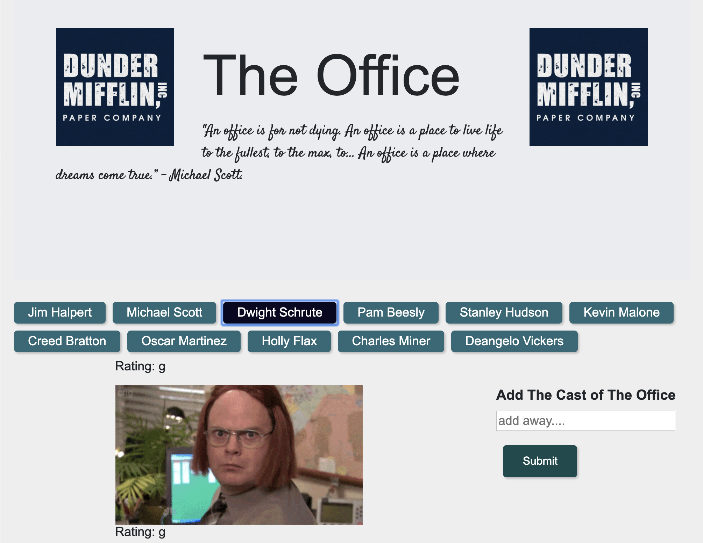

# GifTastic
Theme: The Office
https://melaniebott2691.github.io/GifTastic/

Array called "topics" created with characters from The Office.

Api key used to retrieve array and added "type": 
https://api.giphy.com/v1/gifs/search?q=" + type + "&api_key=BK7Mc3I93bFbs2sQCX7xQVfK2JcEAQRQ&limit=10

Used a loop that appends a button for each string in the array.

When the user clicks on a button, the page grabs 10 static, non-animated gif images from the GIPHY API and places them on the page.

When the user clicks one of the still GIPHY images, the gif animates. If the user clicks the gif again, it should stop playing.

Under every gif, rating displaed (PG, G, so on).

Form added that takes a value from the user input box and adds it to your topics array. Then make a function call that takes each topic in the array and remakes the buttons on the page.

Play and pause animation. Add new tab and display.

